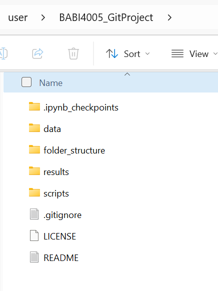
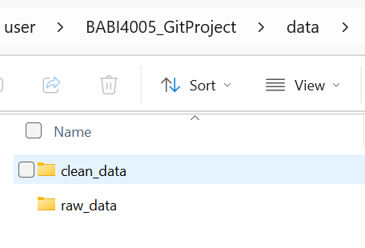
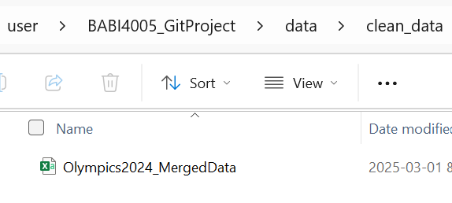
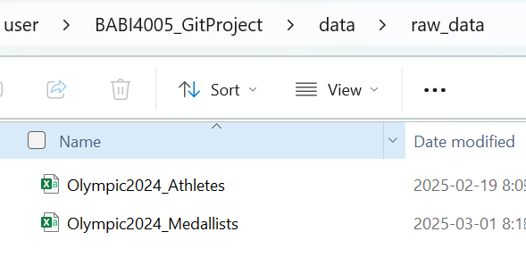
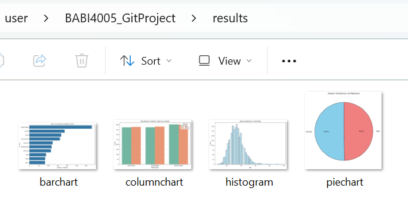
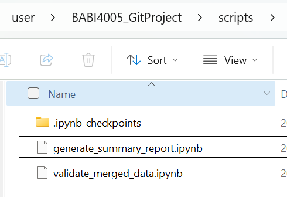

# Olympic 2024 Medallist Data Analysis

## Overview

This project analyzes the Olympic 2024 Medallists dataset, focusing on medal-winning athletes and their attributes. The objective was to structure the project efficiently, merge relevant datasets, and ensure a consistent workflow while keeping raw data files excluded from the repository.

## Project Structure and Data Sources

### Setting Up the File Structure

To ensure a well-organized project, a structured file system was created with the following directories:
* data/ – Contains raw and clean datasets (excluded from GitHub via .gitignore)
* scripts/ – Includes Python scripts and Jupyter notebooks for analysis.
* results/ – Stores visualizations or generated reports.
* folder_structure/ – Contains screenshots of the project directory structure, showing how files are organized.

The datasets were sourced from Kaggle: https://www.kaggle.com/datasets/muhammadehsan02/olympic-summer-games-paris-2024/

### Datasets Used

* Olympic 2024 Medallists (Olympic2024_Medallists.csv)
    -Contains details of all athletes who won medals, including event, country, and medal type.
* Olympic 2024 Athletes (Olympic2024_Athletes.csv)
    -Provides personal details, nationality, and disciplines for all Olympic 2024 athletes.

Note: Data files are ignored in .gitignore, requiring manual download to run the scripts.

### Merging Process & Justification

The medallist dataset was merged with the athlete dataset using a Left Join (how='left') to ensure:

* All medalists remain in the dataset, even if their details are missing in athletes_data.
* If an athlete exists in medallists_data but not in athletes_data, their information (e.g., height, weight) appears as NaN instead of being removed.
* The merged dataset enhances medalist insights by adding extra athlete details when available.
  
Alternative joins were considered but rejected:
* Inner Join: Would exclude medalists missing from the athletes dataset.
* Right/Outer Join: Would introduce non-medalists, making the dataset less focused.

### Branching & Merging Decision

To follow best practices, all structural changes were first implemented in a separate branch (File_Structure) instead of modifying main directly.

Why Work in a Separate Branch?
* Organized folder structure before finalizing the project.
* Allowed testing and adjustments without affecting the main branch.
* Allowed for safe modifications without affecting main

Why Merge File_Structure into main?

After reviewing the structured project, I decided to merge File_Structure into main because:

* The structured files were finalized and ready for the main repository.
* Merging ensured all improvements, including removing outdated files (like unnecessary .md and .html versions of Assignment 3), were included in the final version.
* Keeping everything in File_Structure would make it harder to maintain long-term.

### While this project focused on structuring the data and merging datasets, I also included some initial visualizations to explore trends in the data. These are stored in the results/ folder and include:

* Top 10 Countries by Medal Count (Bar Chart)
* Gender Distribution of Medalists (Pie Chart)
* Age Distribution of Athletes (Histogram)
* Distribution of Medal Types by Gender (Column Chart)

Further analysis could be conducted, including:

* Medal distribution by country or event.
* Athlete characteristics (age, height, weight) of medalists.

	

Below is the structured file organization used in the project:

### Main Folder Structure

### Data Folder

### Cleaned Data Folder

### Raw Data Folder

### Results Folder

### Scripts Folder

